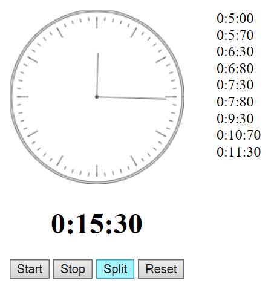

**Use RxJS to Build a Simple Stream-Driven Stopwatch**
========================

Introduction
------------------------
This is the source code for my blog post [Use RxJS to Build a Simple Stream-Driven Stopwatch](http://chenyumin.com/p/use-reactivex-rxjs-to-build-a-stream-driven-stopwatch). 

This repository contains the source code of a simple stream-driven stopwatch written in ReactiveX (RxJS), using HTML5 Canvas to draw / render the shape of the clock / stopwatch.

Author
------------------------
* Chen Yumin

Licensing
------------------------
Please see the file named [LICENSE.md](LICENSE.md).

Contact
------------------------
* Chen Yumin: [*http://ChenYumin.com*][1]  
* Email: [*hello@chenyumin.com*](mailto:hello@chenyumin.com)  

[1]: http://www.ChenYumin.com/ "Chen Yumin"